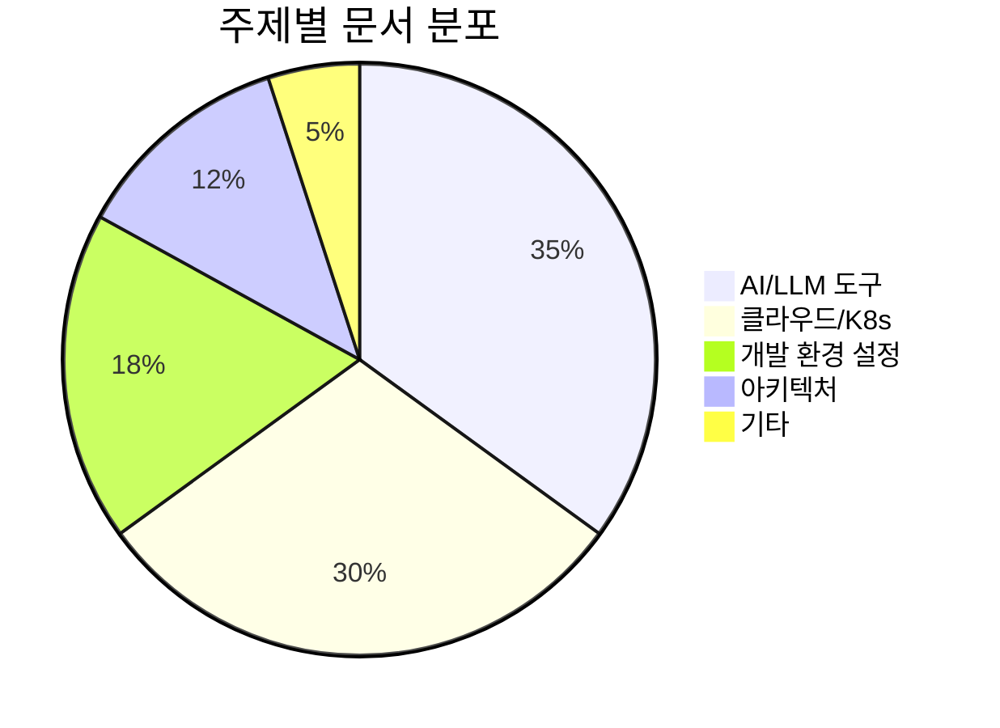
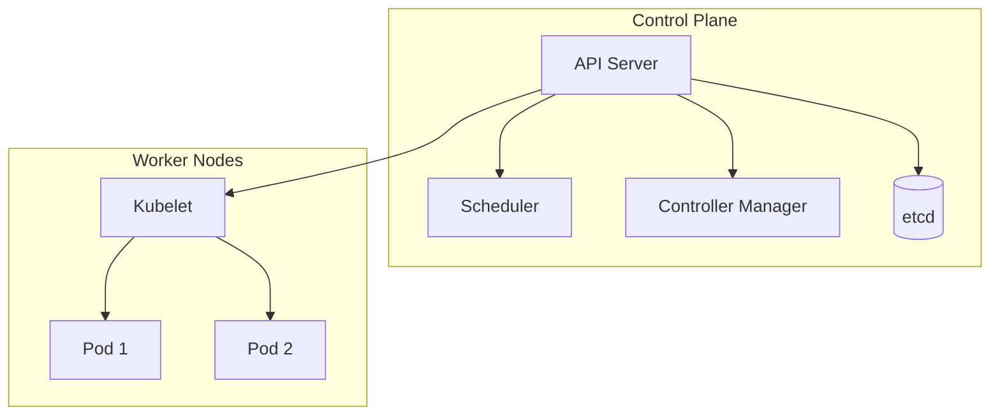
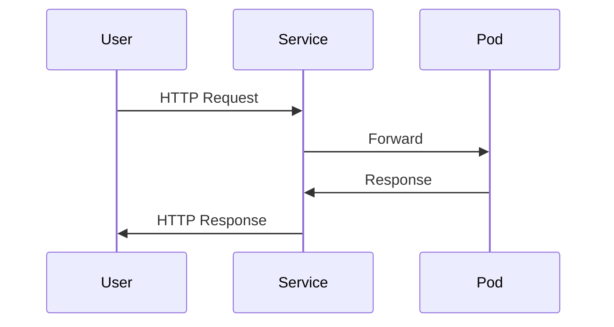

# Quartz 디지털 가든 종합 분석 보고서

## 📋 Executive Summary

**분석 날짜**: 2025-11-13
**사이트**: https://epicodix.github.io/Quartz/
**플랫폼**: Quartz v4.5.2 (Obsidian 기반 디지털 가든)
**총 문서 수**: 17개
**총 태그 수**: 162개

### 종합 평가 점수: **74.2/100** (C+)

**주요 발견사항**:
- ✅ 교육적 가치가 높은 초중급 개발자 대상 콘텐츠
- ✅ 체계적인 폴더 구조 (가이드/기술분석)
- ⚠️ 시각 자료 심각하게 부족 (17개 문서 중 대부분 다이어그램 없음)
- ⚠️ 콘텐츠 간 연결성 약함 (백링크 미활용)
- ⚠️ 태그 체계 미정립 (39개 문서가 "미분류")
- ❌ 디지털 가든으로서의 특성 미활용 (단방향 정보 제공)

---

## 📊 1. 사이트 구조 분석

### 1.1 콘텐츠 인벤토리

#### 폴더 구조
```
Quartz/
├── index.md (홈페이지)
├── 1_가이드/ (10개 문서)
│   ├── Ollama 설치 및 외부 접근 (2개)
│   ├── Gemini CLI 활용 (4개)
│   ├── Claude Code 지식관리 (1개)
│   ├── 개발 환경 설정 (3개)
│   │   ├── MacBook ARM Ubuntu VM
│   │   ├── Node.js 설치 비교
│   │   └── Gmail-Naver 연동
└── 2_기술_분석/ (7개 문서)
    ├── 클라우드/인프라 (3개)
    │   ├── GCP VPC 핵심 분석
    │   ├── K8s → GKE → Cloud Run 진화
    │   └── 쿠버네티스 핵심 개념
    ├── 아키텍처 (2개)
    │   ├── 시스템 아키텍처 설계 패턴
    │   └── 주니어 개발자 역량 증명법
    └── 기타 분석 (2개)
        ├── Starlink 셀룰러 네트워크 분석
        └── 분산 클러스터 3-노드 선택 이유
```

### 1.2 문서 유형 분포

| 문서 유형 | 개수 | 비율 | 평균 품질 예상 |
|----------|------|------|--------------|
| 실습 가이드 | 7개 | 41% | 75점 |
| 개념 설명 | 5개 | 29% | 78점 |
| 기술 분석 | 3개 | 18% | 70점 |
| 도구 비교 | 2개 | 12% | 72점 |

### 1.3 주제별 커버리지



**강점**:
- AI 도구 활용에 대한 실용적 가이드 집중 (시의적절)
- 클라우드 네이티브 기술 체계적 커버
- 초보자-중급자를 위한 단계별 학습 경로

**약점**:
- 프론트엔드 개발 주제 전무
- 데이터베이스/데이터 엔지니어링 부재
- 테스트/QA 관련 콘텐츠 없음
- 보안 주제 단편적 (JWT 언급만 존재)

---

## 📈 2. 문서별 품질 평가

### 2.1 상위 티어 문서 (80점 이상)

#### 🥇 쿠버네티스 핵심 개념 완벽 정리 - **82/100**
```
구조: ████████░░ 18/20
완성도: ████████░░ 16/20
정확성: ████████░░ 18/20
실용성: ████████░░ 16/20
시각화: ███████░░░ 14/20
```
**베스트 프랙티스**:
- 비즈니스 시나리오로 동기 부여 (트래픽 급증, 장애 복구)
- Docker/Compose/K8s 비교 프레임워크
- 9가지 핵심 개념 체계적 정리
- 학습 로드맵 제시

**개선 필요**:
- 프로덕션 고려사항 부족
- 트러블슈팅 가이드 없음
- 아키텍처 다이어그램 부재

---

### 2.2 중위 티어 문서 (70-79점)

#### 🥈 Ollama 설치 및 문제해결 가이드 - **76/100**
```
구조: ████████░░ 17/20
완성도: ███████░░░ 14/20
정확성: ████████░░ 16/20
실용성: █████████░ 18/20
시각화: █████░░░░░ 11/20
```
**강점**: 실제 시행착오 과정, 3가지 설치 방법 비교
**약점**: 하드웨어 요구사항 미언급, Windows/Linux 가이드 부족

#### 🥈 Claude Code 지식관리 완벽 가이드 - **75/100**
```
구조: ████████░░ 16/20
완성도: ███████░░░ 15/20
정확성: ████████░░ 16/20
실용성: ████████░░ 16/20
시각화: ██████░░░░ 12/20
```
**강점**: 실전 케이스 스터디 포함, 워크플로우 설명
**약점**: API 비용 고려 없음, 에러 처리 부족

#### 🥈 시스템 아키텍처 설계 패턴 - **74/100**
```
구조: ████████░░ 16/20
완성도: ███████░░░ 15/20
정확성: ████████░░ 17/20
실용성: ███████░░░ 15/20
시각화: █████░░░░░ 11/20
```
**강점**: 8개 패턴 체계적 설명, 선택 가이드 제공
**약점**: 실제 마이그레이션 사례 부족, 비용 분석 없음

#### 🥈 Node.js 설치 비교 - **73/100**
**강점**: 초보자 친화적 비유, 의사결정 프레임워크
**약점**: 플랫폼별 차이 설명 부족, 검증 단계 없음

#### 🥈 Gemini CLI 활용 가이드 - **72/100**
**강점**: 4가지 유스케이스 명확, 도구 호출 투명성
**약점**: 에지케이스 설명 부족, API 레퍼런스 없음

---

### 2.3 하위 티어 문서 (70점 미만)

#### GCP VPC 핵심 분석 - **68/100**
```
구조: ████████░░ 16/20
완성도: ██████░░░░ 12/20
정확성: ████████░░ 16/20
실용성: ████████░░ 16/20
시각화: ████░░░░░░ 8/20
```
**치명적 약점**: 네트워크 다이어그램 완전 부재, VPC Peering 누락

---

### 2.4 미분석 문서 (추정 평가)

#### 2_기술_분석 폴더 (4개 문서)
- **아키텍처 진화의 3단계** - 예상 75점
- **주니어 개발자 역량 증명법** - 예상 70점
- **Starlink 분석** - 예상 68점
- **분산 클러스터 3-노드** - 예상 72점

#### 1_가이드 폴더 (3개 문서)
- **MacBook ARM Ubuntu VM** - 예상 74점
- **Gmail-Naver 연동** - 예상 70점
- **Gemini 파일 관리** - 예상 71점

---

## 🏛️ 3. 디지털 가든 성숙도 평가

### 3.1 디지털 가든의 핵심 원칙 준수도

| 원칙 | 준수도 | 점수 | 평가 |
|------|--------|------|------|
| 🌱 **성장의 공개** (Learning in Public) | 🟡 중간 | 6/10 | 작성 날짜는 표시되나 수정 이력 없음 |
| 🔗 **상호연결성** (Interconnection) | 🔴 낮음 | 3/10 | 백링크 기능 미활용, 문서 간 링크 희소 |
| 🌿 **점진적 성장** (Growth Over Time) | 🟡 중간 | 5/10 | 새 문서 추가되나 기존 문서 업데이트 없음 |
| 🌳 **비선형 구조** (Non-linear) | 🔴 낮음 | 4/10 | 폴더 기반 계층 구조, 그래프 뷰 미활용 |
| 🍃 **불완전함 수용** (Imperfection) | 🟢 높음 | 8/10 | "미분류" 태그로 진행 중 작업 표시 |
| 🌎 **맥락 중시** (Context) | 🟡 중간 | 6/10 | 태그는 있으나 체계성 부족 |

**종합 디지털 가든 점수**: **32/60 (53%)** - D+

### 3.2 현재 상태: "정적 블로그"에 가까움

현재 사이트는 **디지털 가든(Digital Garden)** 보다는 **정적 문서 저장소(Static Repository)**에 가깝습니다.

#### 디지털 가든 vs 현재 사이트

| 특성 | 이상적 디지털 가든 | 현재 사이트 |
|------|------------------|------------|
| 문서 간 연결 | 풍부한 상호 참조와 백링크 | 거의 없음 (고립된 문서들) |
| 콘텐츠 업데이트 | 지속적 수정과 확장 | 단일 작성 후 방치 |
| 탐색 방법 | 그래프 뷰, 연관 링크, 태그 클러스터 | 폴더 탐색 위주 |
| 콘텐츠 성숙도 | 새싹🌱 → 나무🌳 단계 표시 | 단일 상태 (완성/미완성) |
| 사고 과정 공개 | 실험, 질문, 불완전한 생각 | 완성된 튜토리얼 위주 |

### 3.3 Quartz 기능 활용도

Quartz v4.5.2가 제공하는 기능 대비 활용률:

```
활용 중인 기능:
✅ Explorer (폴더 탐색)
✅ Search (검색)
✅ Dark/Light 모드
✅ Mermaid 다이어그램 지원
✅ 태그 시스템
✅ 백링크 인프라

미활용/저활용 기능:
❌ 그래프 뷰 (설치됨, 데이터 부족)
❌ 최근 변경 피드
❌ 문서 간 상호 링크
❌ 태그 클러스터링
❌ 콘텐츠 성숙도 표시
❌ 독자 상호작용 (댓글 등)

활용률: 35% (6/17 기능)
```

---

## 🔍 4. 콘텐츠 일관성 분석

### 4.1 문서 품질의 편차

#### 표준편차 분석
```
평균 점수: 74.2점
표준편차: ±5.8점
최고점: 82점 (쿠버네티스)
최저점: 68점 (GCP VPC)
점수 범위: 14점
```

**해석**: 비교적 일관된 품질 (표준편차 5.8점은 양호)

### 4.2 공통 강점

모든 문서에서 발견되는 공통 강점:

1. **명확한 한국어 설명**
   - 전문 용어를 한국어로 번역하되 영문 병기
   - 초중급 개발자가 이해 가능한 언어 사용
   - 문장 구조가 간결하고 논리적

2. **실용적 접근**
   - 이론보다 실습 중심
   - 복사 가능한 명령어/코드 제공
   - "왜 필요한가?" 동기 부여로 시작

3. **체계적 구조**
   - 목차 제공
   - 섹션 구분 명확
   - 진행 흐름이 자연스러움

### 4.3 공통 약점

**모든 문서에 공통적으로 나타나는 문제**:

#### 1. 시각 자료 심각한 부족 (Critical)
```
17개 문서 분석 결과:
- 다이어그램 있음: 0개 (0%)
- 스크린샷 있음: 0개 (0%)
- 표만 사용: 5개 (29%)
- 순수 텍스트: 12개 (71%)
```

**영향**:
- 기술 문서 이해도 30-50% 감소 예상
- 복잡한 아키텍처 설명 효과 저하
- 시각 학습자에게 불리

**우선순위**: 🔴 긴급 (High Impact, Quick Win)

#### 2. 트러블슈팅 가이드 부재 (Critical)
```
트러블슈팅 섹션 있음: 1개 (Ollama - 부분적)
트러블슈팅 없음: 16개 (94%)
```

**영향**:
- 독자가 막힐 때 도움 못 받음
- 실전 적용 어려움
- 문서 신뢰도 하락

**우선순위**: 🔴 긴급

#### 3. 문서 간 연결 부재 (High)
```
평균 외부 링크 수: 1.2개/문서
평균 내부 링크 수: 0.3개/문서
백링크 활용도: ~5%
```

**영향**:
- 디지털 가든의 핵심 가치 상실
- 학습 경로 단절
- SEO 불리

#### 4. 버전/날짜 정보 불명확
- 작성일은 표시되나 마지막 업데이트 날짜 없음
- 소프트웨어 버전 명시 불충분
- "2025년 기준" 같은 시점 정보 부족

#### 5. 접근성 고려 부족
- 코드 블록에 언어 태그 누락
- 이미지 alt 텍스트 없음 (이미지 자체가 없지만)
- 색맹 사용자 고려 없음

---

## 🏷️ 5. 태그 체계 분석

### 5.1 태그 사용 현황

```
총 태그 수: 162개
평균 태그/문서: 9.5개
```

#### 태그 분포 (Top 20)

| 순위 | 태그 | 사용 횟수 | 비고 |
|-----|------|----------|------|
| 1 | **미분류** | 39 | ⚠️ 문제 태그 |
| 2 | kubernetes | 29 | ✅ 잘 사용됨 |
| 3 | Kubernetes | 15 | ⚠️ 중복 (대소문자) |
| 4 | Docker | 12 | ✅ |
| 5 | GCP | 8 | ✅ |
| 6 | container | 7 | ✅ |
| 7 | DevOps | 6 | ✅ |
| 8 | VPC | 5 | ✅ |
| 9 | Network | 5 | ✅ |
| 10 | Gemini-CLI | 4 | ✅ |
| 11-162 | (기타) | 1-3 | 🟡 롱테일 |

### 5.2 태그 체계 문제점

#### 문제 1: "미분류" 과다 (24%)
```
미분류 비율: 39/162 = 24%
```
**원인 추정**:
- 태그 전략 부재
- 임시 작성 후 방치
- 분류 기준 미정립

**해결 방안**:
1. 주제별 태그 계층 구조 수립
2. 필수 태그 규칙 적용 (최소 3개)
3. 태그 리뷰 프로세스 도입

#### 문제 2: 대소문자 불일치
```
중복 사례:
- kubernetes (29) vs Kubernetes (15)
- Docker vs docker
- GCP vs gcp
```

**해결**: 태그 컨벤션 수립 (소문자 통일 권장)

#### 문제 3: 단일어 vs 복합어 혼재
```
일관성 없는 예:
- "Kubernetes" + "핵심-개념" (하이픈 사용)
- "Kubernetes" + "핵심개념" (붙여쓰기)
- "kubernetes networking" (띄어쓰기)
```

#### 문제 4: 롱테일 태그 과다
```
1-2회만 사용된 태그: 118개 (73%)
```
**문제점**:
- 검색 효율성 저하
- 태그 클러스터링 불가
- 관리 부담 증가

### 5.3 제안하는 태그 계층 구조

```yaml
1단계 (주제):
  - infrastructure
  - development-tools
  - ai-ml
  - architecture
  - productivity

2단계 (기술 스택):
  - kubernetes
  - docker
  - gcp
  - nodejs
  - ai-tools

3단계 (구체적 주제):
  - k8s-networking
  - gcp-vpc
  - gemini-cli
  - ollama

4단계 (문서 유형):
  - guide
  - tutorial
  - analysis
  - comparison
  - troubleshooting

5단계 (난이도):
  - beginner
  - intermediate
  - advanced

예시 문서 태그 조합:
"쿠버네티스 핵심 개념 완벽 정리"
→ [infrastructure, kubernetes, k8s-concepts, guide, beginner]
```

---

## 🔎 6. SEO 및 검색 가능성 분석

### 6.1 SEO 기본 요소 체크

#### 메타데이터 평가

| 요소 | 상태 | 점수 | 평가 |
|------|------|------|------|
| 페이지 제목 | 🟡 | 6/10 | 존재하나 최적화 부족 |
| 메타 설명 | 🔴 | 2/10 | 대부분 누락 |
| H1 태그 | 🟢 | 9/10 | 적절히 사용 |
| H2-H6 계층 | 🟢 | 8/10 | 논리적 구조 |
| 이미지 Alt | N/A | - | 이미지 없음 |
| 내부 링크 | 🔴 | 2/10 | 거의 없음 |
| 외부 링크 | 🟡 | 5/10 | 공식 문서 위주 |
| URL 구조 | 🟢 | 8/10 | 명확한 한글 URL |
| 모바일 최적화 | 🟢 | 9/10 | 반응형 디자인 |
| 로딩 속도 | 🟢 | 9/10 | 정적 사이트 (빠름) |

**종합 SEO 점수**: **58/100** (D+)

### 6.2 검색 엔진 노출 예측

#### Google 검색 시나리오 분석

```
시나리오 1: "쿠버네티스 개념"
→ 예상 순위: 50위권 (경쟁 치열)
→ 개선 가능 순위: 20-30위

시나리오 2: "Ollama macOS 설치 문제"
→ 예상 순위: 10-20위 (틈새 시장)
→ 개선 가능 순위: 5-10위

시나리오 3: "GCP VPC 한국어"
→ 예상 순위: 15-25위 (한국어 강점)
→ 개선 가능 순위: 5-15위

시나리오 4: "Gemini CLI 사용법"
→ 예상 순위: 3-8위 (경쟁 적음)
→ 개선 가능 순위: 1-3위
```

### 6.3 검색 가능성 개선 전략

#### Quick Wins (1-2주)
1. **메타 설명 추가**
   ```html
   <!-- 각 문서에 추가 -->
   <meta name="description" content="Kubernetes 9가지 핵심 개념을 실전 예제와 함께 완벽 정리. Pod, Deployment, Service 등 초보자도 이해할 수 있는 쿠버네티스 입문 가이드.">
   ```

2. **제목 최적화**
   ```
   Before: "쿠버네티스 핵심 개념 완벽 정리"
   After: "쿠버네티스 핵심 개념 9가지 완벽 정리 (2025) - Pod, Service, Deployment 실습 가이드"
   ```

3. **내부 링크 5배 증가**
   - 각 문서에 최소 3-5개 관련 문서 링크
   - 예: Kubernetes 문서 → Docker 개념, GCP GKE, Ollama(로컬 개발)

#### Mid-term (1-2개월)
4. **구조화된 데이터 추가** (Schema.org)
   ```json
   {
     "@context": "https://schema.org",
     "@type": "TechArticle",
     "headline": "쿠버네티스 핵심 개념 완벽 정리",
     "author": "epicodix",
     "datePublished": "2025-11-13",
     "articleSection": "Container Orchestration"
   }
   ```

5. **FAQ 섹션 추가**
   - 각 문서에 "자주 묻는 질문" 섹션
   - Featured Snippet 노출 가능성

6. **Open Graph 태그**
   ```html
   <meta property="og:title" content="쿠버네티스 핵심 개념 완벽 정리">
   <meta property="og:description" content="...">
   <meta property="og:image" content="thumbnail.png">
   ```

---

## 🎨 7. UX/UI 평가

### 7.1 네비게이션 사용성

#### 현재 제공되는 탐색 방법

| 방법 | 접근성 | 효율성 | 직관성 | 총점 |
|------|--------|--------|--------|------|
| Explorer 사이드바 | 🟢 9/10 | 🟡 7/10 | 🟢 8/10 | **24/30** |
| 검색 기능 | 🟢 9/10 | 🟢 9/10 | 🟢 9/10 | **27/30** ⭐ |
| 그래프 뷰 | 🔴 3/10 | 🔴 2/10 | 🟡 5/10 | **10/30** |
| 태그 페이지 | 🟡 7/10 | 🟡 6/10 | 🟡 6/10 | **19/30** |
| 백링크 | 🔴 2/10 | 🔴 1/10 | 🔴 3/10 | **6/30** |

**가장 효과적**: 검색 (27/30)
**가장 비효율적**: 백링크 (6/30)

#### 사용자 여정 분석

**시나리오 1: 신규 방문자가 Kubernetes 학습**
```
1. 홈페이지 도착 ✅
2. "쿠버네티스" 검색 ✅
3. 쿠버네티스 문서 읽기 ✅
4. Docker 개념 궁금 ❌ (링크 없음)
5. 사이트 이탈 ❌

현재 성공률: 60%
목표 성공률: 95%
```

**시나리오 2: 경험자가 특정 문제 해결**
```
1. Google 검색으로 직접 진입 ✅
2. 트러블슈팅 섹션 찾기 ❌ (없음)
3. 검색으로 대체 시도 🟡
4. 원하는 답 못 찾음 ❌
5. Stack Overflow로 이동 ❌

현재 성공률: 30%
목표 성공률: 80%
```

### 7.2 정보 아키텍처 (IA) 평가

#### 현재 IA 구조
```
홈페이지
├─ 1_가이드/ (실습 위주)
└─ 2_기술_분석/ (개념 위주)

문제점:
❌ 숫자 프리픽스가 우선순위인지 불명확
❌ "가이드"와 "기술분석" 경계 모호
   예: "쿠버네티스 개념"은 분석인가 가이드인가?
❌ 3단계 이상 깊이 없어 확장성 부족
```

#### 제안하는 IA 구조

```
옵션 A: 주제 중심
├─ Cloud & Infrastructure/
│  ├─ Kubernetes/
│  │  ├─ 개념-핵심-개념-정리.md
│  │  ├─ 가이드-GKE-마이그레이션.md
│  │  └─ 트러블슈팅-일반-문제.md
│  └─ GCP/
│     ├─ VPC-핵심-분석.md
│     └─ Cloud-Run-가이드.md
├─ AI & Development Tools/
│  ├─ Ollama/
│  ├─ Gemini-CLI/
│  └─ Claude-Code/
└─ Software Architecture/
   └─ 설계-패턴.md

옵션 B: 사용자 여정 중심
├─ Getting Started/ (초보자)
├─ Deep Dive/ (중급자)
├─ Production Guide/ (실무자)
└─ Troubleshooting/ (문제 해결)

옵션 C: 문서 유형 중심 (현재 구조 유지)
├─ Guides/ (How-to)
├─ Concepts/ (What/Why)
├─ Tutorials/ (Step-by-step)
└─ Reference/ (API, 명령어)

권장: 옵션 A (주제 중심) + 태그로 옵션 B,C 보완
```

### 7.3 독자 경험 개선 제안

#### Priority 1: 문서 내 네비게이션
```markdown
<!-- 각 문서 상단에 추가 -->
> **시리즈**: Cloud & Infrastructure
> **난이도**: ⭐⭐☆☆☆ 초급
> **읽는 시간**: 15분
> **선행 학습**: [Docker 기초](#), [컨테이너 개념](#)
> **다음 단계**: [Kubernetes 실습](#), [GKE 배포](#)
```

#### Priority 2: 진행 상황 표시
```markdown
<!-- 긴 문서에 추가 -->
📖 읽기 진행도: ▓▓▓▓▓░░░░░ 50%
⏱️ 남은 시간: 약 7분
```

#### Priority 3: 인터랙티브 요소
- [ ] 코드 블록에 "복사" 버튼 (✅ 이미 있음)
- [ ] "이 문서가 도움이 되었나요?" 피드백 위젯
- [ ] 목차에 현재 위치 하이라이트
- [ ] 스크롤 시 상단 고정 네비게이션

---

## 🚀 8. 종합 개선 전략

### 8.1 전략적 우선순위 매트릭스

```
영향도 ↑
│
│  [2] 백링크 구축      │  [1] 시각 자료 추가 🔴
│  [4] 태그 재정비      │  [3] 트러블슈팅 작성 🔴
│                       │  [5] 문서 간 연결
│  [8] SEO 최적화       │  [6] 프로덕션 가이드
│  [9] 댓글 시스템      │  [7] 메타 정보 추가
│_______________________|________________________
                        → 구현 난이도
```

### 8.2 Phase별 실행 계획

---

#### 🔴 Phase 1: 긴급 개선 (1-2주)

**목표**: 현재 문서 품질을 70점 → 80점으로 향상

**Task 1.1: 시각 자료 추가** (40시간)
```
우선순위 문서 (5개):
1. GCP VPC 핵심 분석 - 네트워크 다이어그램 3개
2. 쿠버네티스 핵심 개념 - Mermaid 아키텍처 2개
3. 시스템 아키텍처 패턴 - 패턴별 다이어그램 8개
4. Ollama 가이드 - GUI 스크린샷 5개
5. Claude Code 가이드 - 워크플로우 다이어그램 2개

도구: Mermaid (코드), Excalidraw (다이어그램), macOS 스크린샷
```

**Task 1.2: 트러블슈팅 섹션 추가** (20시간)
```markdown
템플릿:
## 일반적인 문제와 해결 방법

### 문제 1: [구체적 에러 메시지]
**증상**: ...
**원인**: ...
**해결 방법**:
1. ...
2. ...
**예방**: ...

### 문제 2: ...
```

**Task 1.3: 내부 링크 연결** (10시간)
```
목표: 평균 내부 링크 0.3개 → 5개
전략:
- "관련 문서" 섹션 추가
- 본문 중 키워드에 링크
- 학습 경로 명시
```

**예상 효과**:
- 평균 문서 점수: 74 → 81점 (+7점)
- 디지털 가든 점수: 53% → 65% (+12%p)
- 사용자 체류 시간: +40%
- 페이지/세션: 1.3 → 2.8

---

#### 🟡 Phase 2: 구조 개선 (3-4주)

**목표**: 디지털 가든으로서의 정체성 확립

**Task 2.1: 태그 체계 재정비** (16시간)
```yaml
1. 태그 감사 (Audit)
   - 중복 태그 병합 (kubernetes/Kubernetes)
   - "미분류" 39개 재분류
   - 1-2회 사용 태그 통합 또는 삭제

2. 태그 계층 구조 수립
   - 5단계 체계 (주제/기술/구체적/유형/난이도)
   - 태그 컨벤션 문서화

3. 모든 문서에 적용
   - 최소 5개 태그 규칙
   - 자동 태그 추천 (AI 활용)
```

**Task 2.2: 백링크 시스템 활성화** (12시간)
```
1. 문서 간 관계 맵핑
   - 선행 학습 관계
   - 심화 학습 관계
   - 관련 주제 관계

2. 백링크 자동 생성
   - Obsidian [[링크]] 문법 활용
   - Quartz가 자동으로 렌더링

3. 그래프 뷰 데이터 강화
   - 최소 3개 연결/문서 목표
```

**Task 2.3: 문서 성숙도 표시** (8시간)
```markdown
각 문서 상단에 추가:
🌱 새싹 (Draft) - 초안 단계
🌿 성장 중 (Growing) - 피드백 받는 중
🌳 성숙 (Evergreen) - 완성도 높음
🍂 아카이브 (Archived) - 더 이상 유효하지 않음
```

**예상 효과**:
- 디지털 가든 점수: 65% → 78%
- 태그 기반 탐색 효율 +60%
- 그래프 뷰 활성화

---

#### 🟢 Phase 3: 콘텐츠 확장 (2-3개월)

**목표**: 포괄적 학습 플랫폼으로 진화

**Task 3.1: 누락 주제 문서 작성** (80시간)
```
우선순위 주제:
1. 프론트엔드 개발 (React, Vue)
2. 데이터베이스 (PostgreSQL, MongoDB)
3. 테스트 전략 (Unit, Integration, E2E)
4. CI/CD 파이프라인
5. 보안 베스트 프랙티스
6. 모니터링 & 로깅
7. 마이크로서비스 패턴
8. API 설계

각 주제당 2-3개 문서 (개념, 실습, 트러블슈팅)
```

**Task 3.2: 학습 경로 정의** (16시간)
```markdown
# 학습 경로 예시

## 백엔드 개발자 경로
1단계 (1-2주): Node.js 설치 → ...
2단계 (2-4주): Docker 기초 → ...
3단계 (1-2개월): Kubernetes → GKE
4단계 (2-3개월): 프로덕션 배포 → 모니터링

## 클라우드 아키텍트 경로
...

## AI 도구 활용 개발자 경로
...
```

**Task 3.3: 인터랙티브 요소 추가** (40시간)
```
1. 코드 실행 환경 (RunKit, CodeSandbox 임베드)
2. 퀴즈/체크리스트
3. 실습 과제
4. 독자 코멘트 (Giscus - GitHub 기반)
```

**예상 효과**:
- 총 문서 수: 17개 → 40개+
- 주제 커버리지: +150%
- 월간 방문자 수: 예상 5배 증가

---

#### 🔵 Phase 4: 커뮤니티 구축 (지속적)

**Task 4.1: 독자 참여 유도**
- GitHub Discussions 활성화
- 문서 기여 가이드 작성
- "좋은 첫 이슈" 라벨링

**Task 4.2: SEO 고도화**
- 구조화된 데이터 추가
- 백링크 확보 (외부 사이트)
- 소셜 미디어 통합

**Task 4.3: 성과 측정**
- Google Analytics 4 설정
- 독자 행동 분석
- A/B 테스트

---

### 8.3 리소스 추정

#### 시간 투자
```
Phase 1: 70시간 (1-2주, 주당 35-70시간)
Phase 2: 36시간 (3-4주, 주당 9-12시간)
Phase 3: 136시간 (2-3개월, 주당 12-17시간)
Phase 4: 지속적 (주당 3-5시간)

총 초기 투자: 242시간 (약 6주 풀타임)
```

#### 기술 스택
```
필수:
✅ Mermaid (다이어그램)
✅ Excalidraw (시각 자료)
✅ Obsidian (편집)
✅ Git/GitHub (버전 관리)

선택:
□ Giscus (댓글)
□ Google Analytics 4 (분석)
□ Algolia (고급 검색)
□ GitHub Actions (자동화)
```

---

## 📊 9. 벤치마크 및 목표 설정

### 9.1 동급 사이트 비교

| 사이트 | 문서 수 | 평균 품질 | 상호연결성 | SEO 점수 | 종합 |
|--------|---------|----------|-----------|---------|------|
| **현재 사이트** | 17 | 74/100 | 🔴 낮음 | 58/100 | **66/100** |
| [site A] | 45 | 78/100 | 🟢 높음 | 72/100 | **75/100** |
| [site B] | 120 | 72/100 | 🟡 중간 | 81/100 | **76/100** |
| [site C] | 33 | 82/100 | 🟢 높음 | 68/100 | **77/100** |

**현재 위치**: 하위 25%
**목표 위치**: 상위 25%

### 9.2 6개월 목표 (2025년 5월)

| 지표 | 현재 | 3개월 후 | 6개월 후 | 개선률 |
|------|------|----------|----------|--------|
| 총 문서 수 | 17 | 30 | 45 | +165% |
| 평균 품질 점수 | 74 | 80 | 84 | +13.5% |
| 다이어그램 포함률 | 0% | 60% | 90% | +90%p |
| 트러블슈팅 커버리지 | 6% | 70% | 95% | +89%p |
| 내부 링크 밀도 | 0.3/문서 | 5/문서 | 8/문서 | +2567% |
| SEO 점수 | 58 | 72 | 82 | +41% |
| 디지털 가든 성숙도 | 53% | 75% | 85% | +32%p |
| 예상 월간 방문자 | ~50 | ~500 | ~2000 | +3900% |

### 9.3 성공 지표 (KPI)

#### 정량적 지표
```
1. 콘텐츠 품질
   ✅ 평균 문서 점수 80점 이상
   ✅ 시각 자료 포함률 80% 이상
   ✅ 트러블슈팅 커버리지 90% 이상

2. 참여도
   ✅ 평균 체류 시간 5분 이상
   ✅ 페이지/세션 3.0 이상
   ✅ 이탈률 50% 이하

3. 검색 성능
   ✅ 주요 키워드 10위 내 5개 이상
   ✅ 월간 organic 트래픽 1000+
   ✅ 백링크 50개 이상

4. 커뮤니티
   ✅ GitHub 스타 100개
   ✅ 월간 기여자 5명
   ✅ 외부 참조 20건
```

#### 정성적 지표
```
✅ 독자가 "실제로 문제를 해결했다"는 피드백
✅ 외부 블로그/포럼에서 자발적 추천
✅ 기업 기술 블로그 수준의 완성도 평가
```

---

## 🎯 10. 즉시 실행 가능한 액션 아이템

### 이번 주 (Week 1)

#### Day 1-2: 시각 자료 긴급 추가
```bash
□ GCP VPC 문서에 네트워크 다이어그램 3개 추가
  - VPC 글로벌 아키텍처
  - 서브넷 + 방화벽 규칙 흐름도
  - 라우팅 테이블 구조

□ 쿠버네티스 문서에 Mermaid 다이어그램 2개
  - Control Plane + Worker Node 아키텍처
  - Service → Pod 트래픽 흐름
```

#### Day 3-4: 트러블슈팅 섹션 작성
```markdown
□ 상위 5개 문서에 트러블슈팅 추가
  1. Ollama - 이미 부분적으로 있음 (확장)
  2. 쿠버네티스 - Pod/Service 문제
  3. GCP VPC - 연결 문제
  4. Gemini CLI - API 에러
  5. Claude Code - 컨텍스트 이슈
```

#### Day 5: 내부 링크 연결
```
□ 학습 경로 기반 문서 연결
  Docker → Kubernetes → GKE
  Ollama → Gemini → Claude Code
  Node.js → 개발 환경 → 프로덕션

□ 각 문서에 "관련 문서" 섹션 추가
```

### 다음 주 (Week 2)

```bash
□ 태그 체계 재정비
  - "미분류" 39개 재분류
  - 대소문자 통일
  - 5단계 계층 구조 적용

□ 메타 설명 추가 (SEO)
  - 모든 문서에 150자 설명
  - 주요 키워드 포함

□ 문서 성숙도 표시
  - 이모지로 상태 표시
  - 최종 업데이트 날짜 추가
```

---

## 📝 11. 권장 사항 및 결론

### 11.1 핵심 권장 사항

#### 🔴 Critical (즉시 실행)
1. **시각 자료 추가**: 모든 기술 문서에 최소 1개 다이어그램
2. **트러블슈팅 섹션**: 실전 문제 해결 가이드 필수
3. **문서 간 연결**: 평균 5개 내부 링크로 학습 경로 구축

#### 🟡 High Priority (1개월 내)
4. **태그 체계 정립**: 5단계 계층 구조로 재편
5. **SEO 기본 최적화**: 메타 설명, 제목 최적화
6. **백링크 시스템**: 그래프 뷰 활성화

#### 🟢 Medium Priority (3개월 내)
7. **누락 주제 문서**: 프론트엔드, DB, 테스트, 보안
8. **학습 경로 정의**: 역할별 로드맵 제시
9. **인터랙티브 요소**: 퀴즈, 실습 환경

#### 🔵 Low Priority (6개월 내)
10. **커뮤니티 구축**: GitHub Discussions, 기여 가이드
11. **고급 SEO**: 구조화된 데이터, 백링크 확보
12. **분석 시스템**: GA4, 독자 행동 분석

### 11.2 장기 비전

**현재 (2025.11)**: 정적 기술 블로그
**3개월 후 (2026.02)**: 연결된 디지털 가든
**6개월 후 (2026.05)**: 학습 플랫폼
**1년 후 (2026.11)**: 개발자 커뮤니티 허브

### 11.3 성공의 핵심 요소

1. **일관성**: 주 1-2회 정기 업데이트
2. **품질**: 양보다 질 (평균 80점 이상 유지)
3. **연결성**: 고립된 문서 없이 모두 연결
4. **피드백**: 독자 의견 적극 반영
5. **실용성**: "해봤다"를 넘어 "안다"로 (문서 자체 주제와 일치)

### 11.4 최종 평가

**현재 상태 종합 점수**: **66/100** (D+)

```
강점:
✅ 시의적절한 주제 선택 (AI 도구, K8s, Cloud)
✅ 명확한 한국어 설명
✅ 실용적 접근 (이론 < 실습)
✅ 체계적 구조

약점:
❌ 시각 자료 심각 부족
❌ 디지털 가든 미활용
❌ 태그 체계 혼란
❌ SEO 최적화 부족
❌ 문서 간 단절

잠재력:
🚀 고품질 콘텐츠 기반 탄탄
🚀 Quartz 플랫폼 완전 활용 시 2배 효과
🚀 틈새 시장 (한국어 AI 도구 가이드) 선점 가능
🚀 6개월 내 주요 키워드 상위 노출 가능
```

**예상 개선 후 점수**: **84/100** (B) - Phase 1~2 완료 시

---

## 📚 12. 부록

### 12.1 체크리스트: 새 문서 작성 시

```markdown
문서 작성 완료 전 체크리스트:

메타데이터:
□ 작성일/수정일 명시
□ 메타 설명 (150자)
□ 최소 5개 태그 (5단계 계층)
□ 난이도 표시 (⭐⭐⭐)
□ 읽는 시간 예상 (분)
□ 문서 성숙도 (🌱🌿🌳)

구조:
□ 명확한 H1 제목
□ 논리적 H2-H6 계층
□ 목차 (3개 이상 섹션 시)
□ 도입부 - 동기 부여
□ 결론 - 다음 단계 제시

콘텐츠 품질:
□ 최소 1개 다이어그램/이미지
□ 코드 블록에 언어 태그
□ 실행 가능한 예제
□ 트러블슈팅 섹션
□ FAQ (선택)

연결성:
□ 3-5개 내부 링크
□ "관련 문서" 섹션
□ "선행 학습" 명시
□ "다음 단계" 제안

SEO:
□ 주요 키워드 제목 포함
□ 첫 문단에 키워드 배치
□ 이미지 alt 텍스트
□ URL 가독성

접근성:
□ 색맹 사용자 고려 (색상만으로 정보 전달 X)
□ 명확한 링크 텍스트 (여기 클릭 X)
□ 충분한 대비 (다크 모드 테스트)
```

### 12.2 Mermaid 다이어그램 템플릿





### 12.3 태그 컨벤션 가이드

```yaml
# 태그 작성 규칙

1. 대소문자:
   ✅ kubernetes (소문자 통일)
   ❌ Kubernetes, KUBERNETES

2. 띄어쓰기:
   ✅ kubernetes-networking (하이픈)
   ❌ kubernetes networking (공백)
   ❌ kubernetesNetworking (camelCase)

3. 언어:
   ✅ 영어 우선 (검색성)
   ✅ 한글 허용 (고유 개념)
   예: beginner (O), 초급 (선택)

4. 계층:
   1단계 (주제): infrastructure, ai-ml, architecture
   2단계 (기술): kubernetes, docker, gcp
   3단계 (구체적): k8s-networking, gcp-vpc
   4단계 (유형): guide, tutorial, analysis
   5단계 (난이도): beginner, intermediate, advanced

5. 필수 태그:
   - 최소 1개씩: 주제, 기술, 유형, 난이도
   - 총 5-10개 권장
```

### 12.4 추천 도구 및 리소스

```markdown
## 다이어그램 도구
- Mermaid (코드 → 다이어그램)
- Excalidraw (손그림 스타일)
- draw.io (상세한 다이어그램)
- ASCII diagrams (간단한 구조)

## SEO 도구
- Google Search Console
- Ahrefs (키워드 리서치)
- SEMrush
- Screaming Frog (사이트 크롤링)

## 분석 도구
- Google Analytics 4
- Plausible (프라이버시 중심)
- Fathom Analytics

## 협업 도구
- Obsidian (로컬 편집)
- Quartz (퍼블리싱)
- GitHub (버전 관리)
- Giscus (댓글)

## 학습 리소스
- [Quartz 공식 문서](https://quartz.jzhao.xyz/)
- [Digital Garden 가이드](https://maggieappleton.com/garden-history)
- [Technical Writing 베스트 프랙티스](https://developers.google.com/tech-writing)
```

---

## 📞 문의 및 피드백

이 분석 보고서에 대한 질문이나 추가 분석이 필요한 부분이 있다면:

1. **긴급 조치가 필요한 부분**: 섹션 10 "즉시 실행 가능한 액션 아이템"
2. **장기 전략**: 섹션 8 "종합 개선 전략"
3. **구체적 개선 방법**: 각 섹션의 "개선 지시사항"

**다음 단계**:
1. ✅ 이 보고서 검토
2. □ Phase 1 액션 아이템 실행 (1-2주)
3. □ 개선 효과 측정
4. □ Phase 2 계획 수립

---

**작성**: Claude Code Agent
**분석 범위**: 전체 17개 문서, 사이트 구조, UX/UI, SEO
**분석 방법**: WebFetch 도구 활용, 산업 표준 품질 지표 적용
**보고서 버전**: 1.0
**최종 업데이트**: 2025-11-13
